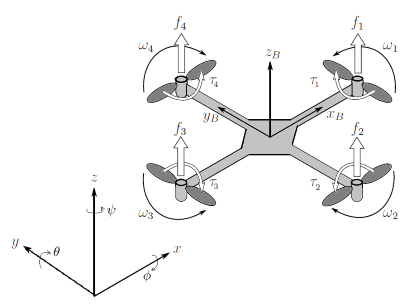

쿼드콥터는 어떻게 움직일까? 오일러-라그랑주로 풀어보는 동역학 모델링

쿼드콥터를 제어하려면 먼저 이 기체가 어떤 물리 법칙에 따라 움직이는지 알아야 합니다. 단순히 "모터를 돌리면 뜬다"를 넘어, "모터 속도를 얼마나 조절해야 내가 원하는 위치로 정확히 갈까?"를 계산하기 위한 **수학적 설계도(모델)**를 그려보는 과정입니다. 오늘은 Raffo 등의 논문[1]과 MATLAB Symbolic Math Toolbox의 문서[2]를  바탕으로 그 흐름을 따라가 보겠습니다.

# Prerequisites

이 포스팅을 더 잘 이해하기 위해선 아래의 내용을 이해하고 오는 것이 좋습니다.

* [Euler-Lagrange 방정식 (변분법)](https://angeloyeo.github.io/2026/03/15/Euler_Lagrange.html)

# 1. 질문의 시작: "쿼드콥터의 상태를 어떻게 정의할까?"

모델링을 하려면 먼저 무엇을 관찰할지 정해야 한다. 우선 [1]의 논문에서 우리가 보고자하는 쿼드콥터의 geometry는 아래 [2]의 그림처럼 정의하고 있다.



쿼드콥터는 공간에서 자유롭게 움직이므로 **6자유도**를 가진다.

*   **위치 ($\xi$):** 지구 기준에서 어디에 있는가? $(x, y, z)^T$.
*   **자세 ($\eta$):** 지구 기준에서 얼마나 기울어져 있는가? 롤, 피치, 요 $(\phi, \theta, \psi)^T$.

여기에 각각의 속도까지 더하면 총 **12개의 상태 변수**가 우리 시스템의 주인공이 된다.

$$(x, y, z, \phi, \theta, \psi, \dot x, \dot y, \dot z, \dot \phi, \dot \theta, \dot \psi)^T % 식 (1)$$

추가로 쿼드콥터의 모션을 기술하기 위해 아래와 같이 파라미터들을 정의하도록 하자.

* $U_1 = (u_1, u_2, u_3, u_4) = (\omega_1^2, \omega_2^2, \omega_3^2, \omega_4^2)$ 이는 각 로터의 각속도의 제곱을 의미한다. $U$를 사용한 것은 이것이 메인 제어 입력임을 나타내기 위함이기도 하다. 또, $U$의 방향은 기체에서의 $+z$ 방향이다. (이 포스팅에서는 기체의 등쪽을 $+z$ 성분으로 정의하고 있다.)
* $(I_{xx}, I_{yy}, I_{zz})$ 이는 body frame의 관성 행렬의 대각 성분을 의미한다.
* $(k,l,m,b,g)$는 각각 추력 계수, 무게 중심으로부터 로터까지의 거리, 쿼드콥터의 질량, 항력 계수, 그리고 중력을 의미한다.
* $f_\xi$는 4개의 프로펠러가 합쳐서 만들어내는 전체 추력과 공기 역학적 방해를 포함하는 병진력을 의미한다.
* $\tau_\eta$는 기체를 회전시키기 위해 각 모터의 속도 차이로 만들어내는 롤, 피치, 요 방향의 회전력을 의미한다.
* $\alpha_T = [A_x, A_y, A_z]^T$는 기체에 가해지는 다양한 항공역학적 힘을 나타낸다.

또, 기체 좌표계($\mathscr{B}$)에서 관성 좌표계 ($\mathscr{I}$, 지구로도 생각할 수 있음)로 변환하기 위한 기본 회전 행렬(Elementary Rotation Matrices)을 정의하도록 하자. 오일러각 $\eta = (\phi, \theta, \psi)^T$에 대해 아래와 같이 정의할 수 있다.

* $R_x(\phi)$: $x$축을 중심으로 롤(Roll) 각도만큼 회전하는 행렬

$$R_x(\phi) = \begin{bmatrix}
  1 && 0 && 0 \\ 
  0 && \cos\phi && -\sin\phi \\ 
  0 && \sin\phi && \cos\phi
\end{bmatrix}% 식 (2)$$

* $R_y(\theta)$: $y$ 축을 중심으로 피치(Pitch) 각도만큼 회전하는 행렬

$$R_y(\theta) = \begin{bmatrix}
  \cos\theta && 0 && \sin\theta \\ 
  0 && 1 && 0 \\ 
  -\sin\theta && 0 && \cos\theta
\end{bmatrix}% 식 (3)$$

* $R_z(\psi)$: $z$ 축을 중심으로 요(Yaw) 각도만큼 회전하는 행렬

$$R_z(\psi) = \begin{bmatrix}
  \cos\psi && -\sin\psi && 0 \\ 
  \sin\psi && \cos\psi && 0 \\ 
  0 && 0 && 1
\end{bmatrix}% 식 (4)$$

이 세 개의 기본 회전 행렬을 이용해서 기체의 좌표계($\mathscr{B}$)에서 관성 좌표계 ($\mathscr{I}$)로 물리량을 (힘, 속도 등)을 변환할수 있다. 변환의 순서는 X, Y, Z 순서로 곱해져야 하므로 행렬의 오른쪽에 벡터가 붙는 것을 생각하면 변환 행렬은 거꾸로 ZYX 순으로 곱해두면 될 것이다.

$$R_\mathscr{I}=R_z R_y R_x = \begin{bmatrix}
  \cos\psi && -\sin\psi && 0 \\ 
  \sin\psi && \cos\psi && 0 \\ 
  0 && 0 && 1
\end{bmatrix}\begin{bmatrix}
  \cos\theta && 0 && \sin\theta \\ 
  0 && 1 && 0 \\ 
  -\sin\theta && 0 && \cos\theta
\end{bmatrix}\begin{bmatrix}
  1 && 0 && 0 \\ 
  0 && \cos\phi && -\sin\phi \\ 
  0 && \sin\phi && \cos\phi
\end{bmatrix}\\
=\begin{bmatrix}
  C\psi C\theta && C\psi S\theta S\phi - S\psi C\phi && C\psi S\theta C\phi + S\psi S\phi \\ 
  S\psi C\theta && S\psi S\theta S\phi + C\psi C\phi && S\psi S\theta C\phi-C\psi S\phi \\ 
  -S\theta && C\theta S\phi && C\theta C\phi
\end{bmatrix}
% 식 (5)$$

여기서 $C\cdot = \cos(\cdot)$이고 $S\cdot = \sin(\cdot)$이다. 예를 들어 기체의 속도 벡터 $v_\mathscr{B}$는 관성계에서의 속도 벡터 $v_\mathscr{I}$로 아래와 같이 변환할 수 있다.

$$v_\mathscr{I}=R_\mathscr{I}\cdot v_\mathscr{B}% 식 (6)$$

또, 프로펠러 회전을 통해 기체에 가하는 힘을 $\hat{f}=U_1^2$라고 하면 관성계에서 봤을 때 힘은 아래와 같이 생각해볼 수 있다.

$$R_\mathscr{I}\hat{f}=R_\mathscr{I_{e_3}}U_1^2 % 식 (7)$$

여기서 $R_\mathscr{I_{e_3}}$의 $e_3$은 z 축만 생각한다는 뜻이다. 여기에 여러가지 항공역학적 힘 $\alpha_T$도 함께 고려해주면 관성계에서 본 병진운동에 관한 힘을 아래와 같이 쓸 수 있다.

$$f_\mathscr{\xi}=R_\mathscr{I}\hat{f}+\alpha_T % 식 (8)$$

# 2. 오일러-라그랑주 방정식을 이용한 상태 방정식 유도

보통 고전 역학에서는 $F=ma$를 쓰지만, 쿼드콥터처럼 축들이 복잡하게 얽혀 있는 시스템은 **에너지** 관점에서 접근하는 것이 훨씬 깔끔하다. [Euler-Lagrange 방정식 (변분법)](https://angeloyeo.github.io/2026/03/15/Euler_Lagrange.html) 편에서 본 것 처럼 Euler-Lagrange 방정식은 라그랑지안 $L$을 정의할 수 있다면 (나중에 정의할 것임) 아래와 같은 관계로 표현할 수 있다.

$$\frac{d}{dt}\left(\frac{\partial L}{\partial \dot q_i}\right)-\frac{\partial L}{\partial q_i}=Q_i % 식 (9)$$

여기서 $Q_i$는 시스템의 일반화된 힘 (generalized force)이다. 그런데 분명 [Euler-Lagrange 방정식 (변분법)](https://angeloyeo.github.io/2026/03/15/Euler_Lagrange.html) 편에서는 위 식의 우변이 항상 0이 되는 것 처럼 얘기했는데, 왜 0이 아니라 $Q_i$가 붙을까? 그것은 쿼드콥터가 작동하는 시스템은 가만히 내버려두는 보존계가 아니라 외부 힘(추력, 공기 저항, 토크 등)이 작용하는 비보존계이기 때문이다. 아무래도 우리가 모터를 돌려서 가만히 두면 떨어지는 쿼드콥터를 원하는 경로로 이동시켜야 하기 때문에 이런 가정을 하는 것은 굉장히 자연스럽다고 할 수 있다.

이제 이 원리를 따라 '에너지(라그랑지안, $L$)'를 먼저 구해보자.

## (1) 에너지 지도 그리기 (라그랑지안 정의)

라그랑지안($L$)은 **운동 에너지($E_c$)에서 위치 에너지($E_p$)를 뺀 값** 이다.

### 병진 운동 에너지

질량($m$)이 속도($\dot{\xi}$)로 이동할 때 생기는 에너지. 익히 알고 있는 $1/2mv^2$을 벡터 $\dot\xi$의 내적을 이용해서 쓰면 

$$E_{cTra}=\frac{1}{2}m\dot\xi^T\dot\xi % 식 (10)$$

가 된다.

### 회전 운동 에너지

기체가 회전할 때 생기는 에너지. 

쿼드콥터 기체 자체의 회전 운동 에너지는 기체 기준 각속도 ($\omega$)를 이용해 기술하면 아래와 같다.

$$E_{cRot}=\frac{1}{2}\omega^TI\omega % 식 (11)$$

여기서 $I$는 기체 프리엠이서 정의된 대각 관성 행렬이다.

하지만 우리는 시스템을 오일러각 $\eta$로 제어하고 싶을 것이다. (기체의 센서가 느끼는 각속도를 우리가 알고 있기 보다는 관성계에서 본 각도인 오일러각을 통해 생각하는 것이 더 자연스럽기 때문이다.) 그러므로 $\omega$를 $\dot\eta$로 변환시키기 위해 아래와 같은 관계를 활용할 수 있다.

$$\dot\eta=W_\eta^{-1}\omega \\ \begin{bmatrix}\dot\phi\\ \dot\theta \\ \dot\psi\end{bmatrix}=\begin{bmatrix}1 && \sin\psi \tan\theta && \cos\phi \tan\theta \\ 0 && \cos\phi && -\sin\phi \\ 0 && \sin\phi\sec\theta  && \cos\phi \sec\theta\end{bmatrix}\begin{bmatrix}p \\q \\ r\end{bmatrix} % 식 (12)$$

여기서 $\eta = [\phi, \theta, \psi]^T$이고 $\omega = [p, q, r]^T$이며, $p, q, r$은 각각 기체 고정 프레임에서의 각속도이다.

따라서, 

$$E_{cRot}=\frac{1}{2}(W_\eta \dot\eta)^TI(W_\eta\dot\eta)=\frac{1}{2}\dot\eta^T(W_\eta^TIW_\eta)\dot\eta % 식 (13)$$

와 같이 회전 운동 에너지를 오일러각 $\eta$로 표현해줄 수 있으며, 이 때 괄호 안의 부분인 $W_\eta^TIW_\eta$를 새로운 관성 행렬 $J(\eta)$로 정의하여 쓰면

$$\Rightarrow E_{cRot}=\frac{1}{2}\dot\eta^TJ\dot\eta % 식 (14)$$

가 된다.

이때 중요한 점은 기체 내부 센서가 느끼는 회전($\omega$)을 우리가 관찰하는 각도 변화율($\dot{\eta}$)로 변환해 기술했다는 점이다. 또, 이를 위해 **변환 행렬($W_\eta$)** 을 사용해 지구 기준 관성 행렬($J$)을 만들었다는 점에 주목하도록 하자.

### 위치 에너지

중력에 의해 높이($z$)에 따라 생기는 에너지 

$$E_P= mgz % 식 (15)$$

### 최종 라그랑지안

최종적으로 라그랑지안은 운동에너지 $E_C$에서 포텐셜 에너지 $E_P$를 빼준 것과 같으며 아래와 같이 기술할 수 있다.

$$L=E_{cTra}+E_{cRot}-E_P=\frac{1}{2}m\dot\xi^T\dot\xi+\frac{1}{2}\dot\eta^TJ\dot\eta-mgz % 식 (16)$$

## (2) 병진 운동 도출 - "우리가 아는 그 F=ma"

이제 식 (16)를 위치($\xi$)에 대해 식 (9)의 오일러-라그랑주 미분을 수행하면 병진 운동이 어떠해야하는지 도출할 수 있다. 이 때 병진 운동이 말하는 것은 "기체의 높이를 변화시키는 건 무엇일까?" 라고도 할 수 있다. 식 (9)의 $q_i$에 위치 $\xi$를 대입해 주고, $Q$를 알짜힘 $f_\xi$로 생각해준다면 아래와 같이 식 (9)를 변형시킬 수 있다.

$$\text{식 (9)}\Rightarrow \frac{d}{dt}\left(\frac{\partial L}{\partial \dot \xi}\right)-\frac{\partial L}{\partial \xi}=f_\xi % 식 (17)$$

여기서 $f_\xi$는 4개의 프로펠러가 합쳐서 만들어내는 전체 추력과 공기 역학적 방해를 포함하는 병진력을 의미한다. 다만 참고문헌 [2]에서는 추력만 계산하고 있는데, 이는 참고문헌 [2]의 목적은 MPC 제어기 설계를 위한 목적이므로 불확실한 외란은 제거하고 확실한 물리량인 중력과 추력으로만 모델을 구성한 것으로 생각한다. 하여튼, 전개를 계속해보면,

$$\Rightarrow \frac{d}{dt}m\dot{\xi}-(-mge_3)=f_\xi % 식 (18)$$

$$m\ddot{\xi}+mge_3=f_\xi % 식 (19)$$

여기서 $e_3$은 z 방향 단위 벡터이다.

* 결과: $m\ddot{\xi} + mge_3= f_\xi  $.

결과적으로 $F=ma$가 좀 복잡하게 써진 것을 얻었다고 볼 수 있다. 식 (8)을 참고하여 이를 $\xi$에 대해 풀어 써주면 아래와 같다.

$$\begin{cases}
\ddot x = \frac{1}{m}\left(\cos\psi \sin \theta \cos \phi+\sin\psi\sin\phi\right)U_1 + \frac{A_x}{m}\\
\ddot y = \frac{1}{m}\left(\sin \psi \sin \theta \cos \phi - \cos \psi \sin \phi\right)U_1 + \frac{A_y}{m}\\
\ddot z = -g + \frac{1}{m}\left(\cos \theta \cos\phi\right)U_1 + \frac{A_z}{m}
\end{cases} % 식 (20)
$$

## (3) 회전 운동 도출 - "진짜 복잡한 건 지금부터"

이제 식 (16)를 자세($\eta$)에 대해 식 (9)의 오일러-라그랑주 미분을 수행한다. 여기서 쿼드콥터 모델링의 꽃인 **관성항**과 **코리올리 항**이 튀어나온다.

$$\text{식 (9)} \Rightarrow \frac{d}{dt}\left(\frac{\partial L}{\partial \dot \eta}\right)-\frac{\partial L}{\partial \eta}=\tau_\eta % 식 (21)$$

여기서 $\tau_\eta$는 기체를 회전시키기 위해 각 모터의 속도 차이로 만들어내는 롤, 피치, 요 방향의 회전력을 의미한다. 식 (21)을 부분적으로 전개해보면,

$$\frac{d}{dt}\left(\frac{\partial L}{\partial \dot \eta}\right)=\frac{d}{dt}\left(J\dot\eta\right)=J(\eta)\ddot\eta+\dot J(\eta, \dot\eta)\dot\eta % 식 (22)$$

이고

$$\frac{\partial L}{\partial \eta}=\frac{1}{2}\frac{\partial}{\partial \eta}\left(\dot\eta^TJ(\eta)\dot\eta\right) % 식 (23)$$

이다. 따라서, 식 (21)은 아래와 같이 쓸 수 있는 것이다.

$$\text{식 (21)}\Rightarrow J(\eta)\ddot\eta+\dot J(\eta, \dot\eta)\dot\eta-\frac{1}{2}\frac{\partial}{\partial \eta}\left(\dot\eta^TJ(\eta)\dot\eta\right) % 식 (24)$$

여기서 우변의 두 번째, 세 번째 항을 $\dot\eta$로 묶으면,

$$\Rightarrow J(\eta)\ddot\eta+\left(\dot J(\eta, \dot\eta) - \frac{1}{2} \frac{\partial}{\partial \eta}\dot\eta^TJ(\eta)\right)\dot\eta % 식 (25)$$

여기서 $J(\eta)$를 $M(\eta)$ 라고 참고문헌 [1]에서 바꿔서 써주고 있고, 큰 괄호로 묶인 것을 Coriolis matrix $C(\eta, \dot\eta)$로 쓰고 있다.

$$\Rightarrow M(\eta)\ddot{\eta} + C(\eta, \dot{\eta})\dot{\eta} = \tau_\eta % 식 (26)$$

*   **왜 $M(\eta)$ 인가? (관성 행렬):** 에너지를 속도로 미분한 후 다시 시간으로 미분할 때 생긴다. 기체가 얼마나 회전에 저항하는지를 나타낸다.
*   **왜 $C(\eta, \dot{\eta})$ 인가? (코리올리 행렬):** 회전 관성이 각도에 따라 변하기 때문에 생긴다. 롤과 피치가 동시에 일어날 때 요(Yaw) 축에 영향을 주는 것과 같은 **축 간의 간섭(자이로스코프 효과 등)**을 수학적으로 담아낸 행렬이다.
*   **우변 ($\tau_\eta$):** 우리가 모터 속도 차이를 이용해 만들어낸 롤, 피치, 요 방향의 **회전력(토크)** 이다.

이를 정리하면,

$$\ddot\eta=M(\eta)^{-1}(\tau_\eta-C(\eta,\dot\eta)\dot\eta) % 식 (27)$$

와 같이 정리할 수 있다.

# 완성된 쿼드콥터의 지도

위의 과정들을 거치면 드디어 12개의 미분 방정식으로 이루어진 **상태 공간 방정식**이 완성됩니다.

1.  **위치 변화:** 현재 속도에 의해 결정됨.
2.  **속도 변화:** 기체의 기울기와 모터 추력($U_1$)에 의해 결정됨 (식 (20))
3.  **각도 변화:** 현재 각속도에 의해 결정됨.
4.  **각속도 변화:** 가해준 토크($\tau$)와 복잡한 회전 간섭($C$)을 관성($M$)으로 나눈 값에 의해 결정됨. (식 (27))

상태 벡터는 12개의 성분이며 아래와 같이 쓸 수 있으며,

$$X=[x_1, x_2, x_3, x_4, x_5, x_6, x_7, x_8, x_9, x_{10}, x_{11}, x_{12}]^T \\
 = [x,y,z,\phi,\theta,\psi,\dot x,\dot y, \dot z, \dot \phi, \dot\theta, \dot\phi]^T % 식 (28)$$

최종적으로 상태 방정식은 아래와 같은 관계로 서술할 수 있다.

$$\dot X (t)= \begin{bmatrix}
x_7 \\ x_8 \\ x_9 \\ x_{10} \\ x_{11} \\ x_{12} \\ 
\frac{1}{m}\left(\cos x_6 \sin x_5 \cos x_4+\sin x_6\sin x_4\right)U_1 + \frac{A_x}{m} \\
\frac{1}{m}\left(\sin x_6 \sin x_5 \cos x_4 - \cos x_6 \sin x_4\right)U_1 + \frac{A_y}{m} \\
-g + \frac{1}{m}\left(\cos x_5 \cos x_4\right)U_1 + \frac{A_z}{m}\\
M(\eta)^{-1}(\tau_\eta-C\dot\eta)
\end{bmatrix}$$

이렇게 도출된 모델은 **MPC(모델 예측 제어)** 와 같은 고급 제어 알고리즘의 '엔진'이 되어, 쿼드콥터가 스스로 미래를 예측하며 비행할 수 있게 만든다.

# MATLAB을 이용한 상태 함수 구축과 Jacobian 도출

참고 문헌 [2]에서와 같이 지금까지의 내용은 MATLAB의 Symbolic Math Toolbox를 이용해서 상태 함수로 구축하는 것이 가능하며, 특히 손 쉽게 상태 함수의 Jacobian을 계산할 수 있다.

우선, $\eta$에 해당하는 롤, 피치, 요 각도를 정의하도록 하자.

```
syms phi(t) theta(t) psi(t)

% Transformation matrix for angular velocities from inertial frame
% to body frame
W = [ 1,  0,        -sin(theta);
      0,  cos(phi),  cos(theta)*sin(phi);
      0, -sin(phi),  cos(theta)*cos(phi) ];

% Rotation matrix R_ZYX from body frame to inertial frame

function [Rz,Ry,Rx] = rotationMatrixEulerZYX(phi,theta,psi)
% Euler ZYX angles convention
    Rx = [ 1,           0,          0;
           0,           cos(phi),  -sin(phi);
           0,           sin(phi),   cos(phi) ];
    Ry = [ cos(theta),  0,          sin(theta);
           0,           1,          0;
          -sin(theta),  0,          cos(theta) ];
    Rz = [cos(psi),    -sin(psi),   0;
          sin(psi),     cos(psi),   0;
          0,            0,          1 ];
    if nargout == 3
        % Return rotation matrix per axes
        return;
    end
    % Return rotation matrix from body frame to inertial frame
    Rz = Rz*Ry*Rx;
end

R = rotationMatrixEulerZYX(phi,theta,psi);
```

그리고 관성 좌표계의 inertia matrix에 해당하는 $J$를 정의하도록 하자. 이는 식 (13)과 식 (14) 사이에서 언급한 것을 확인할 수 있다.

```
% Create symbolic variables for diagonal elements of inertia matrix
syms Ixx Iyy Izz

% Inertial frame velocities from body fixed frames to inertial frame.
I = [Ixx, 0, 0; 0, Iyy, 0; 0, 0, Izz];
J = W.'*I*W;
```

이제 Coriolis matrix $C(\eta,\dot\eta)$를 정의하도록 하자. 이는 식 (25)와 식 (26) 사이에서 언급되었으며 다시 한번 쓰자면 아래와 같다.

$$C(\eta,\dot\eta)=\frac{d}{dt}J-\frac{1}{2}\frac{\partial}{\partial \eta}(\dot\eta^TJ)$$

```
% Coriolis matrix
dJ_dt = diff(J);
h_dot_J = [diff(phi,t), diff(theta,t), diff(psi,t)]*J;
grad_temp_h = transpose(jacobian(h_dot_J,[phi theta psi]));
C = dJ_dt - 1/2*grad_temp_h;
C = subsStateVars(C,t);
```

이제 몇 $\tau_\eta$와 전체 Thrust인 $U_1$을 정의하도록 하자. 아래 MATLAB 코드에서는 Thrust를 $T$로 썼다.

```
% Define fixed parameters and control input
% k: lift constant
% l: distance between rotor and center of mass
% m: quadrotor mass
% b: drag constant
% g: gravity
% ui: squared angular velocity of rotor i as control input
syms k l m b g u1 u2 u3 u4

% Torques in the direction of phi, theta, psi
tau_beta = [l*k*(-u2+u4); l*k*(-u1+u3); b*(-u1+u2-u3+u4)];

% Total thrust
T = k*(u1+u2+u3+u4);
```

이렇게 하여 필요한 변수 정의들은 완료되었고, 본격적으로 state를 정의할 수 있게 된다.

```
% Create symbolic functions for time-dependent positions
syms x(t) y(t) z(t)

% Create state variables consisting of positions, angles,
% and their derivatives
state = [x; y; z; phi; theta; psi; diff(x,t); diff(y,t); ...
    diff(z,t); diff(phi,t); diff(theta,t); diff(psi,t)];
state = subsStateVars(state,t);
```

또한, 식 (29)에서와 같이 상태 방정식을 정의하면 아래와 같다. 여기서 $\alpha_T$ 에 대한 고려는 없는 것을 알 수 있다. 이것은 MPC 제어기에 넣을 상태 방정식에 대해서는 기체 자체에 대한 모델링만 하는 것이 바람직하기 때문이다.

```
f = [ % Set time-derivative of the positions and angles
      state(7:12);

      % Equations for linear accelerations of the center of mass
      -g*[0;0;1] + R*[0;0;T]/m;

      % Euler–Lagrange equations for angular dynamics
      inv(J)*(tau_beta - C*state(10:12))
];

f = subsStateVars(f,t);
```

참고문헌 [2]에서는 파라미터 변수들에 특정 값들을 집어 넣어서 사용하고 있긴 하여 여기에도 적어둔다.

```
% Replace fixed parameters with given values here
IxxVal = 1.2;
IyyVal = 1.2;
IzzVal = 2.3;
kVal = 1;
lVal = 0.25;
mVal = 2;
bVal = 0.2;
gVal = 9.81;

f = subs(f, [Ixx Iyy Izz k l m b g], ...
    [IxxVal IyyVal IzzVal kVal lVal mVal bVal gVal]);
f = simplify(f);
```

마지막으로 state와 state의 Jacobian을 계산할 수 있게 된다. 이 부분이 Symbolic Math Toolbox를 이용하는 백미라고 할 수 있다.

```
% Calculate Jacobians for nonlinear prediction model
A = jacobian(f,state);
control = [u1; u2; u3; u4];
B = jacobian(f,control);
```

그리고 이 state와 jacobian을 MATLAB Function으로 출력해준다. 이렇게 해주어서 추후 MPC 모델링에 그대로 가져다 쓸 수 있다. 

```
% Create QuadrotorStateFcn.m with current state and control
% vectors as inputs and the state time-derivative as outputs
matlabFunction(f,'File','QuadrotorStateFcn', ...
    'Vars',{state,control});

% Create QuadrotorStateJacobianFcn.m with current state and control
% vectors as inputs and the Jacobians of the state time-derivative
% as outputs
matlabFunction(A,B,'File','QuadrotorStateJacobianFcn', ...
    'Vars',{state,control});
```

이외 Helper 함수들은 아래에 적어둔다.

```
function stateExpr = subsStateVars(timeExpr,var)
    if nargin == 1 
        var = sym("t");
    end
    repDiff = @(ex) subsStateVarsDiff(ex,var);
    stateExpr = mapSymType(timeExpr,"diff",repDiff);
    repFun = @(ex) subsStateVarsFun(ex,var);
    stateExpr = mapSymType(stateExpr,"symfunOf",var,repFun);
    stateExpr = formula(stateExpr);
end

function newVar = subsStateVarsFun(funExpr,var)
    name = symFunType(funExpr);
    name = replace(name,"_Var","");
    stateVar = "_" + char(var);
    newVar = sym(name + stateVar);
end

function newVar = subsStateVarsDiff(diffExpr,var)
    if nargin == 1 
      var = sym("t");
    end
    c = children(diffExpr);
    if ~isSymType(c{1},"symfunOf",var)
      % not f(t)
      newVar = diffExpr;
      return;
    end
    if ~any([c{2:end}] == var)
      % not derivative wrt t only
      newVar = diffExpr;
      return;
    end
    name = symFunType(c{1});
    name = replace(name,"_Var","");
    extension = "_" + join(repelem("d",numel(c)-1),"") + "ot";
    stateVar = "_" + char(var);
    newVar = sym(name + extension + stateVar);
end
```

# 마치며

결국 쿼드콥터의 모델링은 **"우리가 가해준 에너지($U_1, \tau$)가 어떻게 기체의 운동 에너지로 변환되는가"** 를 추적하는 과정이었다. 수식은 복잡해 보이지만 그 바탕은 $F=ma$가 좀 더 복잡하게 써진 것이라고 볼 수 있다. 이렇게 구한 쿼드콥터의 동적 모델을 이용해서 다음 편에선 쿼드콥터의 MPC를 이해해보고자 한다.

# 참고 문헌

* [1] Raffo, G. V., et al. (2010). "An integral predictive/nonlinear H∞ control structure for a quadrotor helicopter." Automatica.
* [2] Derive Quadrotor Dynamics for Nonlinear Model Predictive Control, MathWorks [(link)](https://kr.mathworks.com/help/symbolic/derive-quadrotor-dynamics-for-nonlinearMPC.html)
